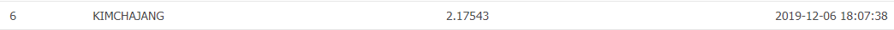

# Mission 13. 2019 Jeju BigData Competition
https://dacon.io/cpt13/228543

총 264팀 중 6등을 하였으며, 3명의 팀원으로 구성되어 대회에 참가하였습니다.

처음으로 상금이 걸려있는 Machine Learning Competition이며, 팀으로도 처음 참가한 대회입니다.

학과에서 뜻이 맞는 학우들과 함께 약 한달간 집중하여 대회에 임하였습니다. 

이전 경험을 통해서 어느정도의 성능을 냈으나, 상위권으로 진입하기에는 어려웠습니다.

하지만, 백지장도 맞들면 낫다라는 것을 팀원들과 이야기하고 떠오른 아이디어들로 변수 가공하고, 외부데이터를 가져와서 활용하니 미미했던 성능이 점차 개선되는 것에 희열을 느꼈습니다.

결국, 최종 6등이라서 상금은 받지 못했지만 상위권의 등수를 받게 되엇다는 것에 뜻 깊은 경험이라고 생각합니다.

## 대회 요약

### 1. 배경 

외국인과 관광객까지 고려하면 전체 상주인구는 90만명을 넘을 것으로 추정됩니다. 

제주도민 증가와 외국인의 증가로 현재 제주도의 교통체증이 심각한 문제로 떠오르고 있습니다. 

따라서, 제주테크노파크는 교통난 심화를 해결하기 위해 데이터 분석 대회를 개최합니다. 

### 2. 주최/주관

- 주최 : (재)제주테크노파크
- 주관 : DACON

### 3. 데이터

- 데이터 다운로드 : [2019 Jeju BigData Competition - 퇴근시간 버스승차인원 예측 데이터 다운로드](https://drive.google.com/drive/u/0/folders/1xunrEwgBuA1SFYx5_Xxk1kQc0ExLNeo3)
- 제공 데이터 및 제출 양식 설명 : [2019 Jeju BigData Competition - 퇴근시간 버스승차인원 예측 제공 데이터 및 제출 양식 설명](https://dacon.io/index.php?mid=cpt13&document_srl=235439)

- 추가 사용 가능 데이터
            a) https://dacon.io/kcbdown   (8회 kcb 시각화 대회의 제주도 금융라이프 데이터(jeju_financial_life_data.csv)
            b) 행정동별 위도 경도 데이터( 행정_법정동 중심좌표.xlsx ) (H - 행정동, B - 법정동)
 
### 4. 일정 (UTC+ 9 (한국) 기준)

- 제출 : 2019년 11월 11일 09:00 ~ 2019년 12월 06일 23:59 
- 평가 및 수상자 발표 : 2019년 12월 07일 ~ 12월 16일

- 시상 : 2019년 12월 20일 (장소 미정 - 제주시) 

### 5. 상금 / 수여 팀

- 1등 : 400만원
- 2등 : 200만원
- 3등 : 100만원

## Change log

#### 2019-11-17
* date processing : 월~일을 의미하는 더미변수에서 주말, 평일만 구분하도록함
* bus_route_id, station_code, station_name scoring : 종속변수에 따라 점수화하여 재정의

#### 2019-11-20
* id, code, name 3개 변수 점수화 rank함수 활용, 그리고 변수 자체를 바꾸는 것이 아닌 score칼럼을 추가하는 방식으로 바꿈
* total_ride와 total_takeoff 칼럼 추가
* Averge Model을 validation하는 함수 추가

#### 2019-11-24
* 종속변수만 log1p한 후 테스트, 독립변수 종속변수중 왜도 첨도 조정해야하는 것들만 선택해서 테스트 : 성능개선이 되지 않아 기각

#### 2019-11-27
* 거리를 harvesine 계산식으로 바꿈
* 6-8시간이 상관관계가 낮아서 8-12시간으로 통합함
* 0의 값을 가진 데이터중 반정도를 임의로 삭제 (성능이 너무 안좋아져서 기각)
* 모델을 3개를 평균내어 xgb 0.45, lgb 0.45, rf 0.1의 가중평균
* prediction값을 반올림 (기각 성능이 조금 떨어짐)
* lightgbm을 튜닝함

#### 2019-11-28
* bus_bts 데이터를 train과 test 일자에 맞게 나눔
* 노선별 탑승고객유행 변수 추가, 수치화 or 0과 1 (성능을 더 낮춤 기각)
* 월-목 , 금-일로 weekend 변수 수정 (기각)
* 서귀포시, 제주시 구분 (기각)
* station_code로 고객유형 변수 추가 (기각)

#### 2019-12-03
* 한 station에서 최대 265의 값을 가지지만 평균을 내면 1까지 떨어지고, 평균중에 제일 큰값은 10임
* 요일별 시각화 그래프 그림
* 루트랑 코드 합쳐서 scoring하니 0.1 상승
* 요일별 낮 하루 총 유동인구 (8~12) 변수 추가 0.1 상승

#### 2019-12-05
* 금토일 1, 그외 0
* latitude, logitude 학습시 제외
* bus_route_socre, station_code_score 학습 시 포함
* 위도, 경도 동서남북 기준으로 새로 할당
* 할당한 대로 가까운 곳에 맞게 dist_name 변수 추가 후 더미화
* 지금 보니 학습할때 code_sum_pop 넣었는데 빼야 될듯...
* randomforest 튜닝 (튜닝 내용 모델링부분 참고)
* xgboost 튜닝을 빼니 validation 성능이 더 좋았음 (그러나 averaging 할때 뺀게 0.005 개선되어서 뺐음)
#### 2019-12-06
* lgb, xgb rmse 반복 개선 학습 후 lgb, xgb, rf averging model (옵피팅)
* lgb train함수사용하여 반복 개선, date_sum_pop 변수 시간별로 나눔
* code_takeoff_sum_pop 변수 추가
